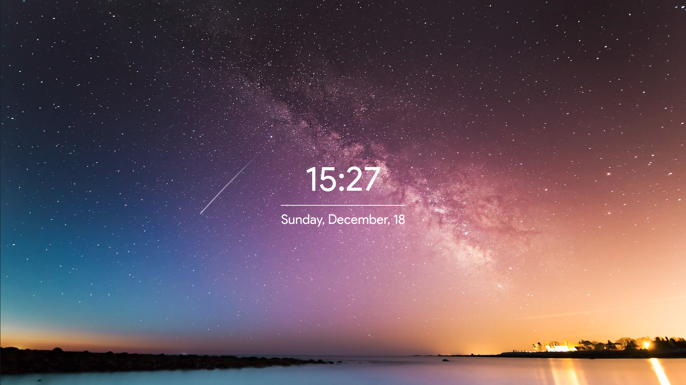

## My Custom Firefox Home Page

This is my custom Firefox *home/new tab* page. It is made to look like the extension [Tabliss](https://tabliss.io/). It uses Unsplash to find random images to set as a background. 

Here is an example image:

You can find the Github link to the page [here](https://michahere.github.io/Home-Page/). I personally use a Firefox extension called [*Custom New Tab Page*](https://addons.mozilla.org/en-US/firefox/addon/custom-new-tab-page/) to set this as my new tab page on Firefox. 

